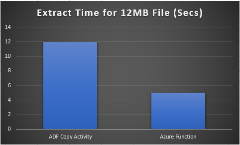
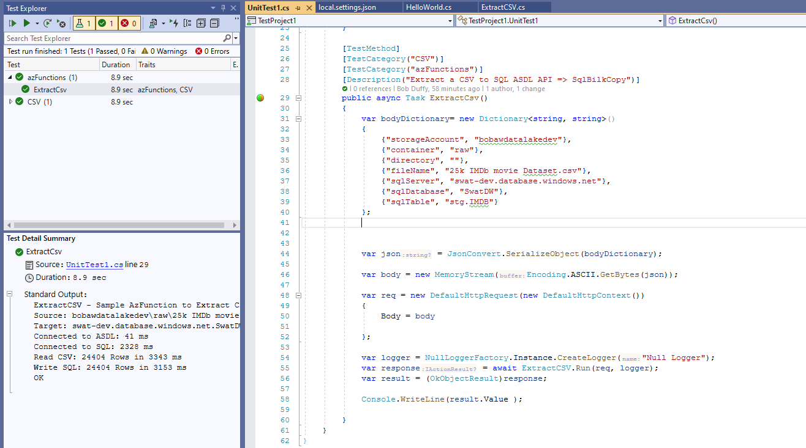
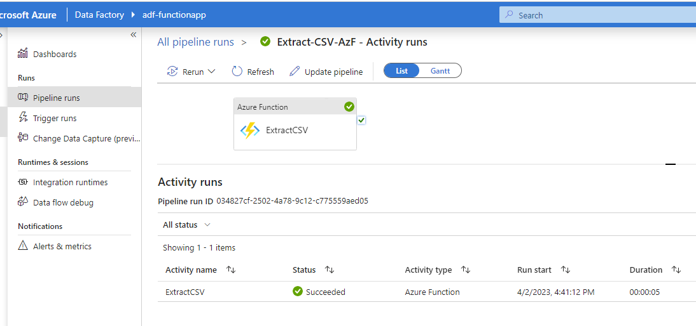

# Sample C# Azure Function for Datalake and SQL
Welcome to the sample c# Azure functions. This contains two sample projects written in Visual Studio 2019:
- ExtractApp.csproj. A sample Azure function which reads a CSV using the DataLakeClient API and writes to a SQL Server using SqlBulkCopy API
- TestProject1.csproj. A sample C# unit test project that shows how make a unit test for an azure function using a mock HTTP request object.

## Key concepts to demo
- A template for writing c# Azure function that use Datalakes and SQL
- Example of using the latest Azure.Identity for both Managed Identity when run from Azure and Visual Studio Azure Identity when run from Visual Studio.
- Example use of the DataLakeServiceClient instead of the more generic BlobServiceClient.
- Example use of SqlBulkCopy API to write a Dataset from Dot.Ney to SQL with a Bulk API.
- Sample Dot.Net Unit Test project showing how to write unit tests to develop and test functions locally so you dont have to mess with debugging as much in Azure.
- Use of a local.settings.json file and Envioronment variables to have different settings in VS Studio versus Azure. Specificaaly the ExcludeManagedIdentityCredential boolean flag.

## Setup and Permissions
To get this example to work you will need a few things:
1. an ASDL Storage Account with a container
2. Upload sampel CSV from https://www.kaggle.com/datasets/utsh0dey/25k-movie-dataset
3. A SQL DB or Syanpse SQL Pool with table creates as per [CreateTable.sql](Minimal/C#/CreateTable.sql)
4. Azure function published from source code.
5. Managed Identity Setup on AzFunction and ADF as per [this blog](https://prodata.ie/2022/06/16/enabling-managed-identity-authentication-on-azure-functions-in-data-factory/)
6. Grant the Function App Identity permissions on the SqlServer.

This can be cumbersome, but good news its once off setup.

## Why use an Azure Function 
Theres a few scenarios where Azure Functions can be useful with data engineering, even if you are using ADF:
- When the source file needs some high code solution to parse naasty files.
- C# does allow for more streamlined file procesing. At the extepse of development time. This can lead to better performance. More than 2x in this case of a 12MN file
- When the low code ADF envionment is not flexible enough.

## Performance Testing ADF Copy v c# Azure function

As a performance test we took a sample 12 MB CSV File which you can download from kaggle here
https://www.kaggle.com/datasets/utsh0dey/25k-movie-dataset

We then read the file and loaded it into SQL using two scenarios
- The Standard Copy Activity using the SqlPool COPY option.
- This sample c# azure function.

Average run times are show below. Potentially the c# azure funciton was more than 2x faster then the ADF Copy Activity.

Note: We were using the most basic tier of azure functions on a Linux host. The "consumption" plan is about 1 core and 1.5GB ram so really limited in resources.

## Testing c# Azure Function from VS Unit Test and from ADF
We can invoke the AzFunction either locally from VS Unit Test or once pulished from ADF. Examples of these two experiences are below

c# Unit Test Running using Test Explorer

ADF Pipeline runing using Azure Function Activity

## Going from this sample to Production Quality
While the API calls are similae, there are some things we do slighty differently in a commerical/production solution. We didnt show them here to keep it as a simple demo:
- We would not place the code inside the azure function. Better to put the logic into a dedicated Class solution.  
- We write unit tests based on the seperate logic classes rather than try and mock up azure function calls. This lets us develop and test code without worrying about any pecularities of azure functions.
- We do not use the APIs like Azure.Identity, or DataLakeClient within the function or logic class. Instead we create our own library which wraps the APIs for easier re-use.

[def]: .\Performance.PNG